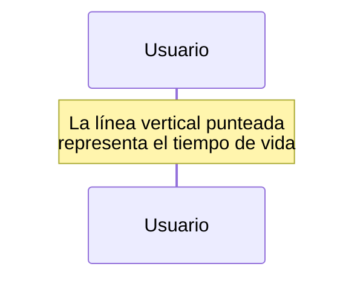
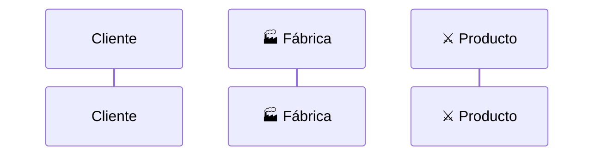
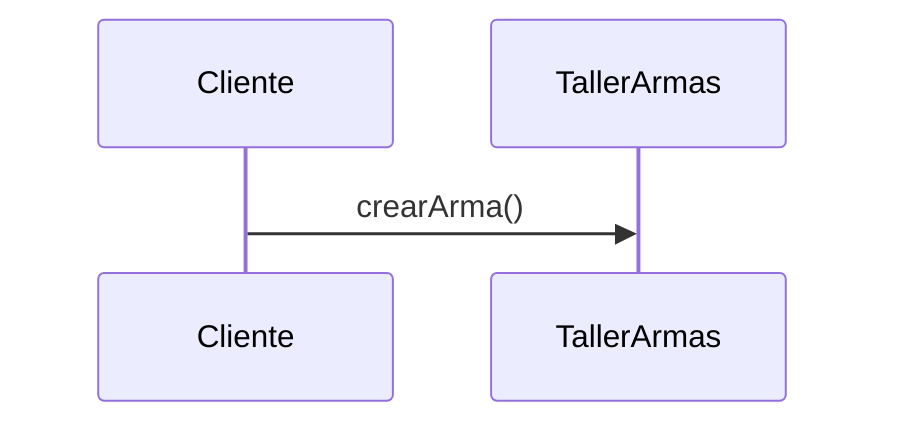
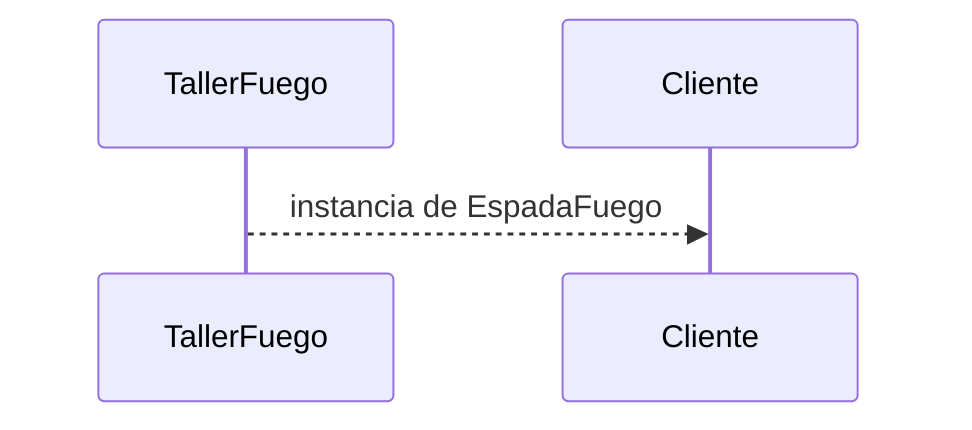
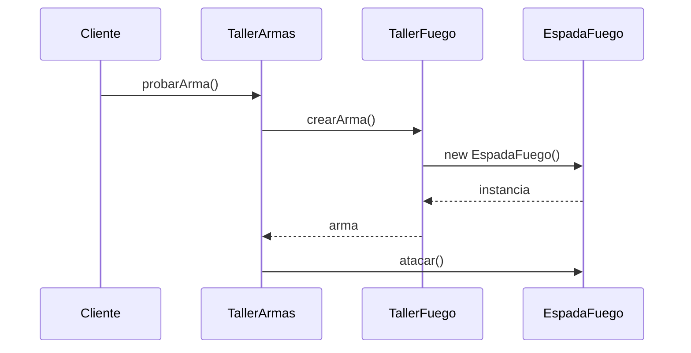
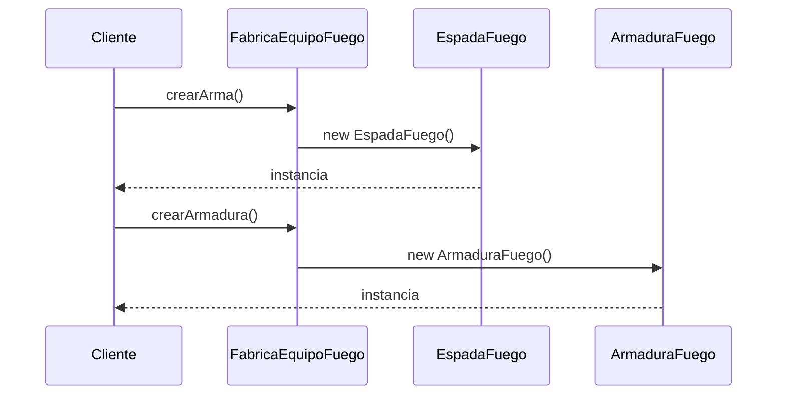

# Arquitectura del Sistema de Equipamiento RPG
## 1. Visión General del Sistema

El sistema implementa dos patrones de diseño complementarios para manejar la creación de equipamiento mágico en un juego RPG:
- `Factory Method`: Para la creación individual de armas
- `Abstract Factory`: Para la creación de sets completos de equipamiento

### 1.1 Contexto del Negocio
El juego permite a los jugadores obtener equipamiento mágico de diferentes elementos (Fuego y Hielo), donde:
- Cada pieza de equipamiento tiene propiedades únicas basadas en su elemento
- Los sets completos proporcionan bonificaciones adicionales cuando se usan juntos
- El sistema está diseñado para ser extensible a nuevos tipos de elementos

## 2. Patrones de Diseño Implementados

### 2.1 Factory Method
#### Propósito
Permite la creación de armas individuales manteniendo el código de creación separado del código que usa las armas.

#### Componentes Principales
1. **Creador Abstracto (TallerArmas)**
   - Define la interfaz para crear armas
   - Proporciona una implementación predeterminada del método de fábrica
   ```java
   abstract class TallerArmas {
       abstract Arma crearArma();
       public void probarArma() { ... }
   }
   ```

2. **Creadores Concretos**
   - TallerFuego: Especializado en armas de fuego
   - TallerHielo: Especializado en armas de hielo
   ```java
   class TallerFuego extends TallerArmas {
       @Override Arma crearArma() { return new EspadaFuego(); }
   }
   ```

3. **Producto (Arma)**
   - Interface que define el comportamiento común de todas las armas
   ```java
   interface Arma {
       void atacar();
       String obtenerTipo();
   }
   ```

4. **Productos Concretos**
   - `EspadaFuego`: Implementación específica de arma de fuego
   - `EspadaHielo`: Implementación específica de arma de hielo

### 2.2 Abstract Factory
#### Propósito
Permite la creación de familias completas de productos relacionados sin especificar sus clases concretas.

#### Componentes Principales
1. **Fábrica Abstracta (FabricaEquipamiento)**
   ```java
   interface FabricaEquipamiento {
       Arma crearArma();
       Armadura crearArmadura();
   }
   ```

2. **Fábricas Concretas**
   - `FabricaEquipoFuego`: Crea sets completos de equipo de fuego
   - `FabricaEquipoHielo`: Crea sets completos de equipo de hielo

3. **Productos Abstractos**
   - `Arma`: Interface para todas las armas
   - `Armadura`: Interface para todas las armaduras

4. **Productos Concretos**
   - Armas: `EspadaFuego`, `EspadaHielo`
   - Armaduras: `ArmaduraFuego`, `ArmaduraHielo`

## 3. Flujos de Trabajo

### 3.1 Línea de Vida


- **Descripción**: La línea vertical punteada que sale de cada participante
- **Significado**: Representa la existencia del objeto en el tiempo
- **Ejemplo en nuestro RPG**: La línea de vida del `Cliente` muestra cuánto tiempo está interactuando con el sistema

### 3.1.1 Participantes


- **Descripción**: Los rectángulos en la parte superior
- **Significado**: Representan objetos o clases que interactúan
- **En nuestro RPG**:
  - `Cliente`: El código que solicita el equipamiento
  - `TallerArmas`: La clase que fabrica las armas
  - `EspadaFuego`: El producto creado

## 3.2 Tipos de Mensajes

### 3.2.1 Mensaje Síncrono


- **Representación**: Flecha con punta llena (→)
- **Significado**: Llamada a método donde el llamador espera una respuesta
- **En nuestro RPG**: Cuando el Cliente solicita un arma y espera recibirla

### 3.2.2 Mensaje de Retorno


- **Representación**: Flecha punteada (⇢)
- **Significado**: Respuesta a una llamada previa
- **En nuestro RPG**: Cuando el taller devuelve el arma creada

## 3.3 Análisis de Nuestros Diagramas

### 3.3.1 Diagrama de Creación de Arma Individual


#### Lectura:
1. El Cliente llama a `probarArma()` en TallerArmas
2. TallerArmas delega la creación al TallerFuego específico
3. TallerFuego crea una nueva instancia de EspadaFuego
4. La instancia se devuelve hacia arriba en la cadena
5. Finalmente, se prueba el arma con `atacar()`

### 3.3.2 Diagrama de Creación de Set Completo


#### Lectura:
1. El Cliente solicita un arma a la FabricaEquipoFuego
2. La Fábrica crea una nueva EspadaFuego
3. La instancia del arma se devuelve al Cliente
4. El Cliente solicita una armadura
5. La Fábrica crea una nueva ArmaduraFuego
6. La instancia de la armadura se devuelve al Cliente

## 4. Extensibilidad

### 4.1 Agregar Nuevo Elemento
Para agregar un nuevo elemento (por ejemplo, Rayo):

1. Crear nuevos productos concretos:
   ```java
   class EspadaRayo implements Arma { ... }
   class ArmaduraRayo implements Armadura { ... }
   ```

2. Crear nuevo taller:
   ```java
   class TallerRayo extends TallerArmas { ... }
   ```

3. Crear nueva fábrica:
   ```java
   class FabricaEquipoRayo implements FabricaEquipamiento { ... }
   ```

### 4.2 Agregar Nuevo Tipo de Equipamiento
Para agregar un nuevo tipo (por ejemplo, Amuletos):

1. Crear nueva interfaz de producto:
   ```java
   interface Amuleto {
       void activarEfecto();
       String obtenerTipo();
   }
   ```

2. Modificar la interfaz FabricaEquipamiento:
   ```java
   interface FabricaEquipamiento {
       Arma crearArma();
       Armadura crearArmadura();
       Amuleto crearAmuleto();  // Nuevo método
   }
   ```

3. Implementar en todas las fábricas concretas

## 5. Consideraciones de Diseño

### 5.1 Ventajas
- Encapsulación de la lógica de creación
- Garantía de consistencia en sets de equipamiento
- Facilidad para agregar nuevos elementos
- Código mantenible y escalable

### 5.2 Desventajas
- Mayor complejidad inicial
- Necesidad de crear múltiples clases por cada nuevo elemento
- Modificaciones costosas al agregar nuevos tipos de equipamiento

### 5.3 Mejores Prácticas
1. Mantener la cohesión entre elementos del mismo tipo
2. Usar nombres descriptivos y consistentes
3. Implementar pruebas unitarias para cada nuevo componente
4. Documentar comportamientos específicos de cada elemento

## 6. Ejemplos de Uso

### 6.1 Creación de Arma Individual
```java
TallerArmas taller = new TallerFuego();
taller.probarArma();
```

### 6.2 Creación de Set Completo
```java
FabricaEquipamiento fabrica = new FabricaEquipoFuego();
Arma arma = fabrica.crearArma();
Armadura armadura = fabrica.crearArmadura();
```